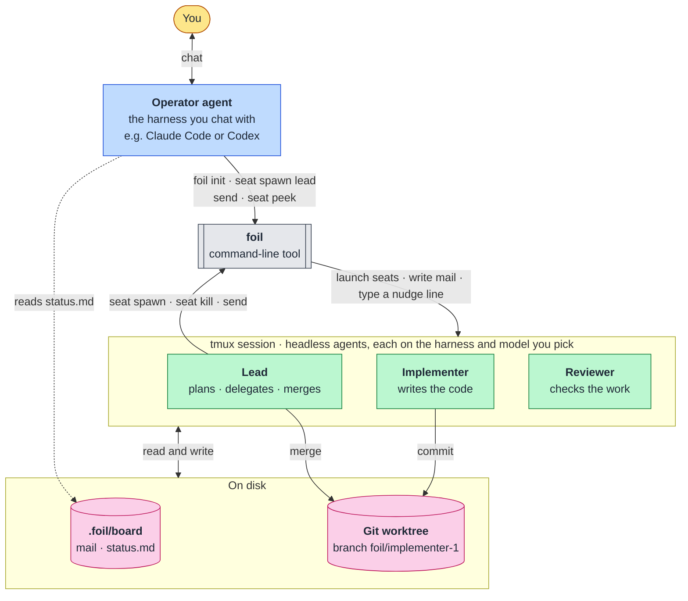

# Foil · 运筹

[](LICENSE)
[](https://github.com/TiantianFlow/foil)
[](https://github.com/TiantianFlow/foil/actions/workflows/ci.yml)
[](pyproject.toml)
[](pyproject.toml)
[](pyproject.toml)

[中文](README.zh-CN.md)

**Your agents' loyal opposition.**

Foil turns the coding agents you already use (Claude Code, Codex, Gemini, OpenCode, Grok) into a small team. You talk to one agent. It hands your goal to a lead. The lead plans the work, gives each task to a worker with its own Git branch, has another agent check the result, and merges it. Every agent runs in tmux, and every message is a file you can read.

## Why Foil

### Stop managing your agents by hand

The pattern that works is a split: one agent plans, another implements, a third reviews. Claude Code even ships an `opusplan` setting that plans with Opus and builds with Sonnet. Across tools, though, the split usually means you do the plumbing: copy the plan into another terminal, relay the result back, remind each agent what was decided.

Foil makes the split a structure. The lead plans, spawns workers by role, sends them tasks as mail, and merges their branches. You talk to one operator agent, and the lead does the managing.

### A clean-context check that doesn't take "done" for an answer

An agent that has worked for an hour grades its own work with everything it believed along the way. It skips the step it forgot, trusts the test it wrote, and says "I'm done" when it isn't. Long sessions make it worse: the context fills up, quality drops, and compaction loses details.

In Foil, every seat starts clean and sees only its role and its task. The reviewer never saw the implementer's reasoning, only the result, so it checks the work instead of the story, and the lead asks for that check before it reports the goal done. Small, clean contexts also let the work run longer and stay correct: each seat does one job, and the plan, mail, and status live on disk, not in anyone's memory. That is the loyal opposition, and where Foil gets its name: a foil is the character whose contrast shows what the other one missed.

### Use the best model for each job, from any provider

Models differ. Some reason better, some write code faster, some cost less, and some still have usage left this week. In Foil, each role is a template that names a harness and a model. The lead can plan on a strong reasoning model, implementers can run on a fast one, and the reviewer can come from a different vendor, which adds a second kind of independence: different training, different blind spots. Each seat uses its own CLI's login, so the work spreads across subscriptions you already pay for. Foil never stores your keys or logins.

## How it works



- **You** talk only to the operator agent.
- **Operator agent**: any harness you like, with its normal interface. It follows the operator skill and never does the project work itself.
- **foil**: this command-line tool. It launches seats in tmux, writes mail, and types a one-line nudge into the recipient's window. It runs no daemon and never interprets what is on a seat's screen.
- **Lead, implementer, reviewer**: agent CLIs running headless in tmux windows, each started with its role's instructions. By default only the implementer gets its own Git worktree and branch.
- **.foil/board**: mail, notes, and `status.md`, as plain files the seats read and write.

## Built to stay out of the way

- **Your own agent runs the fleet.** You don't drive a dashboard or wire agents together by hand. You tell the agent you already use what you want, in whatever interface you like it in, as long as it can run shell commands in your repository. Following one skill file, it starts the lead, checks in, and relays questions.
- **Each CLI works as it is.** Foil starts every agent with that CLI's own documented flags and talks to it the way you would: one short line typed into its window, and the message itself in a file. It never reads the screen to guess what an agent is doing, so a CLI update rarely breaks it, and adding a CLI takes a small preset file, not code.
- **Runs wherever tmux runs.** A command-line tool with no daemon and no GUI, on Linux or macOS, on your laptop or over SSH on a remote machine. Close your terminal and the fleet keeps working; reattach with tmux.
- **Nothing hidden.** Mail, tasks, status, and lessons are plain files, and the work lands on ordinary Git branches. You can read, grep, or edit any of it. They survive a dead tmux session or a reboot, and `foil seat resume` brings the seats back.

## Demo

[docs/demo.md](docs/demo.md) walks through a real run: a failing test, a lead, an implementer, and a reviewer, from `foil init` to the merged fix.

## Get started

You need Python 3.11+, Git, tmux 3.2+, and at least one supported agent CLI (Claude Code, Codex, Gemini, OpenCode, or Grok), already logged in on this machine. Foil never handles that login. Before your first fleet, run each CLI once in this repository and accept its folder-trust, first-run, and opt-in prompts. Trust is per folder. A seat waiting on one of those prompts looks, from outside, like a seat that is working. Your agent asks you to do this, or to confirm it is done, and it reports any prompt it sees rather than answering it. Another CLI can join with a small preset file.

The human's part is one sentence, typed into the coding agent they already use, in the repository:

```text
Install Foil from https://github.com/TiantianFlow/foil, onboard this repository with it, and start a fleet. My goal: <goal>.
```

- The agent installs Foil and runs `foil init`.
- It reads the report and sets `harness`, `model`, and `permission` on `.foil/templates/lead.toml`, `.foil/templates/implementer.toml`, and `.foil/templates/reviewer.toml`. `auto` on the lead alone does not let the workers run unattended.
- It runs the first-run check and sends the goal.
- It never does the project work itself.

An agent that was started without that sentence uses this pointer line instead:

```text
Read .foil/skills/operator.md and follow it. My goal: <goal>.
```

A persistent install of the operator skill is optional. Copy it where that harness discovers skills, at user level, so it stays out of `git status`. No path below was checked against that harness's current docs.

| Harness | Install path | Verified |
|---|---|---|
| any | the pointer line above | required; not a per-harness install |
| Claude Code | `~/.claude/skills/foil-operator/SKILL.md` | no |
| grok, codex, opencode, gemini | none published | no |

### By hand

The same steps, typed yourself. Install Foil, then in the repository:

```sh
uv tool install "git+https://github.com/TiantianFlow/foil.git"
cd your-repo
foil init
```

Read the report, edit the three templates, then spawn the lead once:

```sh
foil seat spawn lead --task "Write board/status.md with state: done"
```

When `.foil/board/status.md` shows `state: done`, send the goal to that lead. Do not spawn the lead again. The lead's first prompt already carries its instructions, so a message holds only the goal or an answer.

```sh
foil send lead "the goal"
foil seat list
foil seat peek lead
```

`.foil/board/status.md` is the lead's own report, including any questions for you; answer them with `foil send lead "..."`. When you are done, `foil seat kill --all` stops every seat and leaves branches and worktrees in place.

### If nothing happens

Run `foil seat peek lead`, and do the same for a seat that was just spawned or resumed. A seat that makes no progress is usually showing a login prompt, a folder-trust prompt, an approval prompt, or the harness's own first-run or opt-in dialog. Answer it in that window (`tmux ls` lists Foil's session and `tmux attach` opens it), or log in to that CLI once by hand, then `foil seat kill lead` and spawn it again.

## Limits

Foil is cooperative protection for seats that follow instructions. It is not isolation from a hostile process. A seat's identity is the `FOIL_SEAT_ID` environment variable Foil sets when it launches that seat. There is no flag a seat can pass to claim another seat. Anything you can do on this machine, a process running as you can do too.

Templates default to `permission = "ask"`, so the harness asks before it acts. Setting `permission = "auto"` inserts that preset's auto flags. For Claude, those flags are `--permission-mode` and `auto`, and the harness can edit files and run commands without asking. That seat is still you.

Foil never interprets what is on a seat's screen. `foil seat peek` prints the raw tmux capture, and `foil seat list` reports `alive`, `dead`, or `killed` from whether the seat's window still exists, not from what is on its screen. Agents say whether they are blocked or done in board files.

A nudge is typed even when the window is not at a prompt. `foil send` writes the mail file first, then types one line into the recipient's window: the sender, a space, and the mail file's absolute path, then Enter. The message body is never typed. If the agent is not waiting for input, those keystrokes still go into the window. Foil does not look at the screen to decide.

## Learn more

- [docs/demo.md](docs/demo.md) — a real run, from `foil init` to the merged fix
- [docs/architecture.md](docs/architecture.md) — components, data flow, and module boundaries
- [skills/operator.md](skills/operator.md), [skills/lead.md](skills/lead.md), and [skills/worker.md](skills/worker.md) — what each role runs
- [CONTRIBUTING.md](CONTRIBUTING.md) — setup and checks
- [CHANGELOG.md](CHANGELOG.md) — release history
