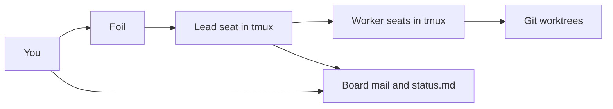

# Foil

[](LICENSE)
[](https://github.com/TiantianFlow/foil)
[](https://github.com/TiantianFlow/foil/actions/workflows/ci.yml)

[中文](README.zh-CN.md)

Foil runs local CLI agents as separate seats in tmux, and keeps their mail and status in files, so one seat can do the work and another can check it from a context the first seat does not share.

## Workflow



You load the operator skill and give it the goal. The lead runs the fleet from there and writes `status.md`. You check the seat list, the lead's pane, and that status file. When the work is finished, you stop every seat. Foil does not do the project work.

## Demo

[docs/demo.md](docs/demo.md) walks through the quick start below, command by command.

## Quick start

You need Python 3.11+, Git, tmux 3.2+, and the Claude CLI, already logged in on this machine. Foil does not handle that login.

Install Foil 0.2.0:

```sh
uv tool install "git+https://github.com/TiantianFlow/foil.git"
```

In a Git repository:

```sh
cd your-repo
foil init .
```

`foil init` writes `.foil`, including the templates and `.foil/skills/operator.md`. It sets `harness` to the first installed CLI among `grok`, `claude`, `codex`, `opencode`, and `gemini`. This walkthrough uses Claude. If init chose another harness, set `harness = "claude"` in `.foil/templates/lead.toml`, `.foil/templates/implementer.toml`, and `.foil/templates/reviewer.toml`. Leave `permission = "ask"`.

Load `.foil/skills/operator.md` into your harness and follow that skill. Tell the harness the goal. The skill starts the fleet, checks in, relays what you say, and tears the fleet down.

The same commands, if you run them yourself:

```sh
foil seat spawn lead --task "Summarize this repository in board/status.md"
foil seat list
foil seat peek lead
```

Read `.foil/board/status.md` for the lead's own report. To pass an answer to the lead:

```sh
foil send lead "the answer"
```

When you are done:

```sh
foil seat kill --all
```

That stops every seat. It does not delete branches or worktrees.

## Compared with one session

One agent session is one process, one context, and one working directory. The same model proposes the change and checks it. If the session ends, what remains is whatever that CLI saved.

Foil seats are separate CLI processes. The implementer works in its own Git worktree and branch. The reviewer does not share that context. Mail is a file the recipient reads. The status you trust is `status.md`, which the lead writes. Stopping tmux does not delete the branch. `foil seat resume` restarts seats whose windows are gone.

## Limits

Foil is cooperative protection for seats that follow instructions. It is not isolation from a hostile process. A seat's identity is the `FOIL_SEAT_ID` environment variable Foil sets when it launches that seat. There is no flag a seat can pass to claim another seat. Anything you can do on this machine, a process running as you can do too.

Templates default to `permission = "ask"`, so the harness asks before it acts. Setting `permission = "auto"` inserts that preset's auto flags. For Claude, those flags are `--permission-mode` and `auto`, and the harness can edit files and run commands without asking. That seat is still you.

Foil never interprets a pane. `foil seat peek` prints the raw tmux capture. `foil seat list` reports `alive`, `dead`, or `killed` from whether the stored window still exists, not from what the text on the screen means. Agents say whether they are blocked or done in board files.

A nudge is typed even when the pane is not at a prompt. `foil send` writes the mail file first, then types one line into the recipient's window: the sender, a space, and the mail file's absolute path, then Enter. The message body is never typed. If the agent is not waiting for input, those keystrokes still go into the pane. Foil does not look at the pane to decide.

## Learn more

- [docs/demo.md](docs/demo.md) — the same quick start, with what each step is for
- [docs/architecture.md](docs/architecture.md) — components, data flow, and module boundaries
- [skills/operator.md](skills/operator.md), [skills/lead.md](skills/lead.md), and [skills/worker.md](skills/worker.md) — what each role runs
- [CONTRIBUTING.md](CONTRIBUTING.md) — setup and checks
- [CHANGELOG.md](CHANGELOG.md) — release history
