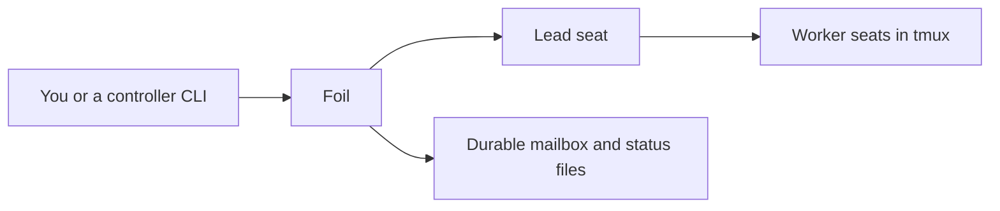

# Foil · 运筹

[](LICENSE)
[](https://github.com/TiantianFlow/foil)
[](https://github.com/TiantianFlow/foil/actions/workflows/ci.yml)

[中文](README.zh-CN.md)

**Your agents' loyal opposition.** Foil coordinates a complementary
fleet of local CLI-agent seats from your shell. One seat implements,
another challenges the work from its own context, and a lead you control
staffs and directs them. Mail and status live in durable files on disk;
seats live in tmux. No hosted control plane, no chat UI, no MCP, and no
Foil login.

The opposition is structural, not theatrical. Foil seats are independent CLI processes,
not subagents sharing one parent model's context. They can
use different CLIs, models, personas, contexts, and worktrees, so a reviewer
can expose correlated blind spots that one agent family might reproduce.
That diversity does not guarantee correctness; it makes disagreement and
independent verification real rather than another voice in the same chat.

If you already run more than one local CLI agent, you know the failure
modes: every voice blended into one chat, context that evaporates when a
tmux session dies, no durable handoff between agents, and steady
pressure to adopt a hosted UI. Foil is the answer that stays in the
shell.

## Why Foil

- **Complementary seats, not one blended voice.** Each seat is a
  distinct agent CLI process with its own role, context, and working
  directory.
- **Durable coordination.** Mailbox messages, acknowledgements, and seat
  status are versioned files on disk. A message stays `queued` until the
  recipient acknowledges it — whether or not anyone was watching.
- **Resumable after interruption.** Kill tmux, reboot, come back:
  `foil resume` revives seats, preferring live tmux, then the CLI's
  native session, then a logged fresh start.
- **Local-first and credential-free.** Seats run on your machine as the
  agent CLIs you have already authenticated locally. Foil never
  requests, stores, or prints provider credentials, and there is no
  Foil account.

## How it works



A typical session: you point Foil at your repository and spawn a lead.
The lead staffs complementary specialists — an implementer to write the
code, a reviewer-challenger to attack the plan from a separate context.
The lead sends tasks as durable mailbox messages, asks for revisions
directly when output falls short, and integrates the evidence that
survives challenge. You inspect everything with ordinary CLI commands
and tmux. Foil is flexible coordination, not a fixed
research→implement→review pipeline.

## Quick Start

You need Python 3.11+, uv, tmux 3.2+, and Git. The example below also
uses locally authenticated `grok` and `opencode` CLIs; Foil never handles
those logins.

Install the pinned public release:

```sh
uv tool install "git+https://github.com/TiantianFlow/foil.git@v0.1.0"
```

To upgrade later, reinstall with the newer release tag:

```sh
uv tool install --reinstall "git+https://github.com/TiantianFlow/foil.git@v0.1.0"
```

Then switch to the repository you want Foil to coordinate. `foil init`
accepts an existing Git repository and preserves every tracked and
untracked file and all Git state; it refuses a non-empty directory that
is not a Git repository. (An empty directory works too — run
`git init -b foil-demo` after init to give it a Git identity.)

```sh
# then in your existing Git repository
cd your-repo
foil init .
foil seat spawn --state-dir STATE_ROOT --fleet FLEET_ID --lead --seat lead --cli grok --role manager
foil seat spawn --state-dir STATE_ROOT --fleet FLEET_ID --seat implementer --cli grok --role implementer
foil seat spawn --state-dir STATE_ROOT --fleet FLEET_ID --seat reviewer-challenger --cli opencode --role reviewer-challenger --permission auto
foil send-message --state-dir STATE_ROOT --fleet FLEET_ID --seat reviewer-challenger --sender lead --body "Please challenge the current plan." --wake
```

Copy `state_root` and `fleet_id` from the JSON that `foil init` prints.
The first seat must be the lead; workers come after. `foil send-message`
persists mail only — pass `--wake`, or run `foil seat wake` after
inspecting tmux, to nudge a seat.

## Operating a fleet

**One worktree per fleet.** Keep a canonical checkout of your project
clean and fast-forwarded to the remote `main`. Create one dedicated
feature worktree per fleet, and run the lead and workers from that
worktree. Never let a fleet mutate the canonical checkout; if it is
dirty, fail and notify rather than altering it. An explicitly selected
alternative base is fine — this is an operating rule for you, not
something Foil enforces.

**Lead-owned membership.** Every fleet starts with one lead. The lead
(or you) spawns workers from the role library when they are needed.
Workers are isolated by default: Foil clones `worktrees/<seat_id>` from
the committed HEAD, so uncommitted files are not copied and later
commits do not refresh clones; `foil doctor` reports the lag.
`--shared-cwd` is the advanced override.

**Honest status.** `working` means the tmux process is alive — not that
a model is thinking. `foil status` reconciles the registry against live
tmux; `foil poll-status` reads only the versioned status files.

**Interruption and resume.** `foil resume` prefers a matching live tmux
window, then the seat's recorded native session, then a logged fresh
start. `foil seat stop` keeps the seat record so resume can continue;
`foil seat remove` deletes it. Spawn is `--permission supervised` by
default, so the CLI asks for approvals; `--permission auto` uses
adapter-declared approval flags.

## Personas, roles, and other CLIs

`foil init` scaffolds a role library — manager, implementer,
reviewer-challenger, and more — under `.foil/roles/`. You can also staff
seats directly from your own Markdown persona catalog; the persona file
is used untouched, with no wrapper:

```sh
foil catalog-list --path ./personas
foil catalog-map --path ./personas --persona NAME --json
foil seat spawn --state-dir STATE_ROOT --fleet FLEET_ID --seat designer --role-file ./personas/designer.md
```

Grok and OpenCode are shipped presets. Other interactive CLIs join
through a declarative seat profile — one TOML owning the executable,
launch/resume/startup argv, session capture, permission flags, working
directory behavior, and environment forwarding by variable name (values
are never persisted):

Save or copy the shipped
[`profiles/pi-interactive.toml`](profiles/pi-interactive.toml) example into
the repository you are coordinating, then pass its path per seat:

```sh
foil seat spawn --state-dir STATE_ROOT --fleet FLEET_ID --seat researcher --profile ./profiles/pi-interactive.toml --role researcher
```

Presets and profiles are the only supported
paths — if a CLI is not a preset and you have not run it through a
profile yourself, do not assume it works. When you pass `--model`, Foil
forwards your choice to the CLI; the CLI's own screen is the source of
truth for which model actually launched.

## Security and limitations

- Foil is cooperative same-user protection, not hostile isolation. Seats
  run as you, with your CLI credentials, on your machine.
- Foil never stores provider credentials and never prints environment
  variables or terminal buffers.
- There is no MCP server, no hosted service, and nothing to log in to.

## Learn more

- [docs/walking-skeleton.md](docs/walking-skeleton.md) — the executable end-to-end verification path
- [docs/design/onboarding.md](docs/design/onboarding.md) — initialization and state-root contract
- [docs/design/profiles.md](docs/design/profiles.md) — the declarative seat profile contract
- [skills/controller](skills/controller), [skills/manager](skills/manager), [skills/worker](skills/worker) — portable skills for the CLIs that drive or join a fleet
