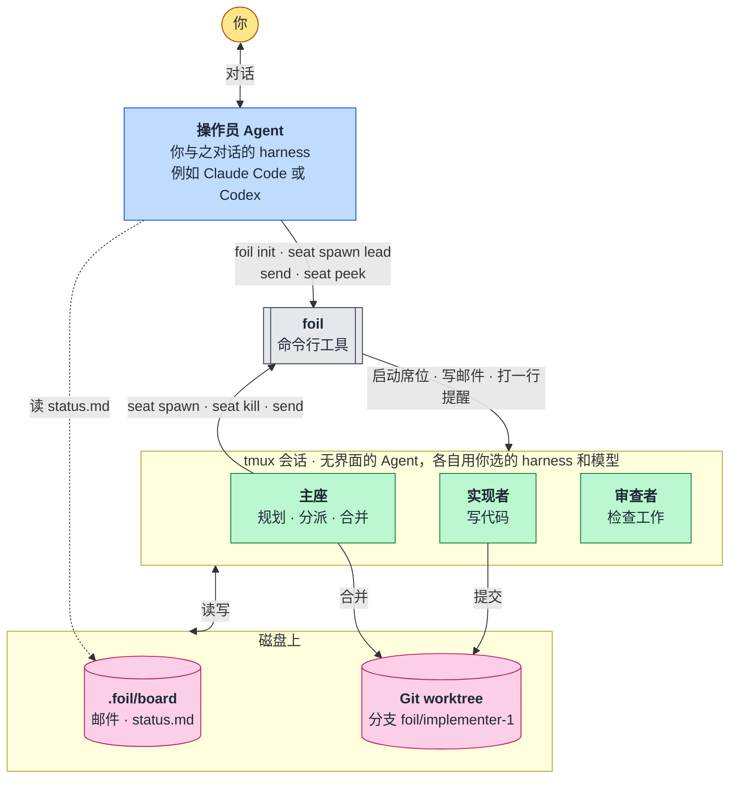

# 运筹 · Foil

[](LICENSE)
[](https://github.com/TiantianFlow/foil)
[](https://github.com/TiantianFlow/foil/actions/workflows/ci.yml)
[](pyproject.toml)
[](pyproject.toml)
[](pyproject.toml)

[English](README.md)

**你的 Agent 们的忠诚反对派。**

运筹把你已经在用的编程 Agent（Claude Code、Codex、Gemini、OpenCode、Grok）组成一支小团队。你只和一个 Agent 对话，它把目标交给主座。主座规划工作，把每个任务交给有自己 Git 分支的工人席位，让另一个 Agent 检查结果，再把结果合并。每个 Agent 都跑在 tmux 里，每条消息都是你能直接读的文件。

## 为什么选择运筹

### 不必再亲手管理你的 Agent

行之有效的做法是分工：一个 Agent 规划，一个实现，一个审查。Claude Code 甚至自带 `opusplan` 设置，用 Opus 规划、用 Sonnet 动手。但跨工具时，这种分工通常意味着由你来打杂：把计划复制到另一个终端，再把结果转述回来，还要提醒每个 Agent 之前定过什么。

运筹把这种分工变成结构。主座负责规划，按角色派出工人席位，用邮件下发任务，再合并它们的分支。你只和一个操作员 Agent 对话，管理的活由主座来做。

### 一个不轻信"做完了"的干净上下文检查

一个干了一小时的 Agent，会带着一路上相信过的一切来给自己的工作打分。它会跳过自己忘掉的那一步，相信自己写的测试，在没做完的时候说"做完了"。会话越长越糟：上下文越塞越满，质量下降，压缩还会丢掉细节。

在运筹里，每个席位都从干净的上下文开始，只看到自己的角色和任务。审查者从没看过实现者的思路，只看结果，所以它检查的是工作本身，而不是那套说法；主座在报告目标完成之前，会先请审查者检查。小而干净的上下文还让工作能持续更久、保持正确：每个席位只做一件事，计划、邮件和状态都在磁盘上，而不是在谁的记忆里。这就是"忠诚反对派"，也是 Foil 这个名字的由来：foil 指的是那个用反差照出另一个角色疏漏的角色。

### 每项工作都用最合适的模型，不限厂商

模型各有长短：有的更会推理，有的写代码更快，有的更便宜，有的这周还剩额度。在运筹里，每个角色是一个模板，写明用哪个 harness 和哪个模型。主座可以用擅长推理的模型做规划，实现者可以用快速的模型，审查者可以来自另一家厂商，这又多了一层独立性：训练不同，盲区也不同。每个席位各自使用自己 CLI 的登录，工作因此分摊到你已经付费的多个订阅上。运筹从不保存你的密钥或登录信息。

## 它如何运转



- **你**只和操作员 Agent 对话。
- **操作员 Agent**：你喜欢的任何 harness，带着它原本的界面。它按操作员技能行事，自己从不做项目本身的工作。
- **foil**：就是这个命令行工具。它在 tmux 里启动席位、写邮件，并往收件人的窗口里打一行提醒。它不跑守护进程，也从不解读席位屏幕上显示的内容。
- **主座、实现者、审查者**：在 tmux 窗口里无界面运行的 Agent CLI，每个都带着自己角色的指令启动。默认只有实现者拥有自己的 Git worktree 和分支。
- **.foil/board**：邮件、笔记和 `status.md`，都是席位读写的普通文件。

## 尽量不碍事的设计

- **由你自己的 Agent 来管理舰队。** 你不需要操作仪表盘，也不用亲手把 Agent 连在一起。你只要告诉自己常用的那个 Agent 想做什么，用哪个界面都行，只要它能在你的仓库里执行命令。它按一份技能文件行事：启动主座、查看进展、转达问题。
- **每个 CLI 都按原样使用。** 运筹用每个 CLI 自己公开的命令行参数启动它，并用你会用的方式和它交流：往它的窗口里打一行短短的提醒，消息本身放在文件里。它从不读屏幕去猜 Agent 在做什么，所以 CLI 升级很少会让它失效；接入新的 CLI 只需要一个小小的预设文件，不用写代码。
- **有 tmux 的地方就能跑。** 一个命令行工具，没有守护进程，也没有图形界面，可以在 Linux 或 macOS 上运行，本机或通过 SSH 连到远程机器都行。关掉终端，舰队照样工作；用 tmux 重新连上即可。
- **没有暗箱。** 邮件、任务、状态和经验都是普通文件，工作成果落在普通的 Git 分支上。你可以直接阅读、搜索或修改其中任何一项。它们经得住 tmux 会话被杀或机器重启，`foil seat resume` 会把席位重新拉起来。

## 演示

[docs/demo.zh-CN.md](docs/demo.zh-CN.md) 完整走一遍真实运行：一个失败的测试、一个主座、一个实现者和一个审查者，从 `foil init` 一直到修复被合并。

## 开始使用

你需要 Python 3.11+、Git、tmux 3.2+，以及至少一个已在本机登录、受支持的 Agent CLI（Claude Code、Codex、Gemini、OpenCode 或 Grok）。运筹从不经手这次登录。在舰队开始之前，先把每个 CLI 手动运行一次，关掉它的首次运行和意见征集对话框。停在这些对话框上的席位，从外面看就和正在工作一样。其他 CLI 只要一个小小的预设文件就能接入。

人要做的只有一句话。在仓库里，把它交给你已经在用的编程 Agent：

```text
Install Foil from https://github.com/TiantianFlow/foil, onboard this repository with it, and start a fleet. My goal: <goal>.
```

- Agent 安装运筹并运行 `foil init`。
- 它读报告，并在 `.foil/templates/lead.toml`、`.foil/templates/implementer.toml` 和 `.foil/templates/reviewer.toml` 里设置 `harness`、`model` 和 `permission`。只把主座改成 `auto` 不会让工人席位无人值守。
- 它做首次运行检查，然后把目标发出去。
- 它自己从不做项目本身的工作。

没有拿到那句话就启动的 Agent，改用这行指针：

```text
Read .foil/skills/operator.md and follow it. My goal: <goal>.
```

持久安装操作员技能是可选的。把它复制到该 harness 发现技能的位置，放在用户级，这样它不会出现在 `git status` 里。下面的路径都没有对照该 harness 的当前文档核对过。

| Harness | 安装路径 | 已核对 |
|---|---|---|
| 任意 | 上面的指针行 | 必需；不是按 harness 安装 |
| Claude Code | `~/.claude/skills/foil-operator/SKILL.md` | 否 |
| grok、codex、opencode、gemini | 没有公布的路径 | 否 |

### 手动操作

同样的步骤，自己来敲。先安装运筹，再在仓库里：

```sh
uv tool install "git+https://github.com/TiantianFlow/foil.git"
cd your-repo
foil init
```

读报告，改那三个模板，然后只启动一次主座：

```sh
foil seat spawn lead --task "Write board/status.md with state: done"
```

当 `.foil/board/status.md` 里出现 `state: done` 时，把目标发给这个主座。不要再启动一次主座。主座的第一条提示已经带上了它的指令，所以消息里只放目标或回答。

```sh
foil send lead "the goal"
foil seat list
foil seat peek lead
```

`.foil/board/status.md` 是主座自己的报告，也会列出要问你的问题；用 `foil send lead "..."` 回答。结束时，`foil seat kill --all` 会停掉每个席位，分支和 worktree 都会保留。

### 如果什么都没发生

运行 `foil seat peek lead`；刚启动或刚恢复的席位也这样看一眼。一个没有进展的席位，通常停在登录提示、审批提示，或者 harness 自己的首次运行或意见征集对话框上。在那个窗口里处理它（`tmux ls` 能列出运筹的会话，`tmux attach` 可以进入），或者先手动登录一次那个 CLI，然后 `foil seat kill lead`，再重新启动主座。

## 限制

运筹保护的是遵守说明的席位，不是把恶意进程隔离开。席位身份来自运筹启动它时设置的环境变量 `FOIL_SEAT_ID`。没有哪个参数能让一个席位自称是另一个席位。在这台机器上你能做的事，以你的身份运行的进程也能做。

模板默认是 `permission = "ask"`，harness 在行动前会询问。把 `permission` 设成 `auto` 会插入该预设的自动批准参数。对 Claude，这些参数是 `--permission-mode` 和 `auto`，harness 可以不经询问就改文件、跑命令。那个席位仍然是你。

运筹从不解读窗口里的内容。`foil seat peek` 打印 tmux 原样捕获的文本，`foil seat list` 报告 `alive`、`dead` 或 `killed`，依据是席位的窗口还在不在，而不是屏幕上显示了什么。Agent 是否卡住、是否做完，由它们自己写在看板文件里。

即使窗口不在输入提示符，提醒也会被打进去。`foil send` 先把邮件写成文件，再往收件人的窗口打一行：发件人、一个空格、邮件文件的绝对路径，然后是 Enter。消息正文从不被打进窗口。如果 Agent 并不在等输入，这些按键仍然会进入窗口。运筹不会先看窗口再决定打不打。

## 进一步了解

- [docs/demo.zh-CN.md](docs/demo.zh-CN.md) — 一次真实运行，从 `foil init` 到修复被合并
- [docs/architecture.md](docs/architecture.md) — 组件、数据流和模块边界
- [skills/operator.md](skills/operator.md)、[skills/lead.md](skills/lead.md)、[skills/worker.md](skills/worker.md) — 每个角色运行哪些命令
- [CONTRIBUTING.md](CONTRIBUTING.md) — 搭建与检查
- [CHANGELOG.md](CHANGELOG.md) — 版本历史
