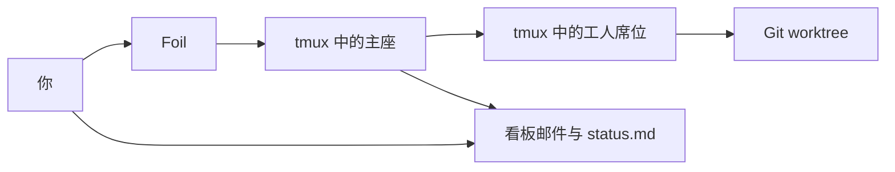

# 运筹 · Foil

[](LICENSE)
[](https://github.com/TiantianFlow/foil)
[](https://github.com/TiantianFlow/foil/actions/workflows/ci.yml)

[English](README.md)

运筹把本机 CLI Agent 作为独立席位放进 tmux，并把邮件和状态留在文件里，这样一个席位可以干活，另一个席位可以在它看不见的上下文里检查结果。

## 工作流程



你初始化项目，并用目标拉起主座。主座拉起工人席位、给他们发邮件，并写 `status.md`。你查看席位列表、主座窗格和那份状态文件。工作结束后，你停掉所有席位。运筹不做项目本身的工作。

## 演示

本仓库没有演示录像。[docs/demo.md](docs/demo.md) 按命令逐步走一遍下面的快速开始。

## 快速开始

你需要 Python 3.11+、Git、tmux 3.2+，以及已经在本机登录的 Claude CLI。运筹不经手这次登录。

安装运筹 0.2.0：

```sh
uv tool install "git+https://github.com/TiantianFlow/foil.git"
```

在一个 Git 仓库里：

```sh
cd your-repo
foil init .
```

`foil init` 会写好 `lead`、`implementer` 和 `reviewer` 的模板。它把 `harness` 设成 `grok`、`claude`、`codex`、`opencode`、`gemini` 里本机第一个已安装的 CLI。这篇说明用 Claude。如果 init 选了别的 harness，把 `.foil/templates/lead.toml`、`.foil/templates/implementer.toml` 和 `.foil/templates/reviewer.toml` 里的值改成 `harness = "claude"`。保留 `permission = "ask"`。

把操作员技能从 `.foil/skills/operator.md` 加载到你的 harness。这个文件是操作员的工作流程。主座技能和工人技能写在同一目录。

```sh
foil seat spawn lead --task "Summarize this repository in board/status.md"
foil seat list
foil seat peek lead
```

主座自己的报告在 `.foil/board/status.md`。结束时：

```sh
foil seat kill --all
```

这会停掉每个席位。它不删除分支，也不删除 worktree。

## 和一次会话相比

一次 Agent 会话是一个进程、一份上下文、一个工作目录。同一个模型既提出改动，又检查改动。会话结束后，留下的是那个 CLI 自己保存的东西。

运筹的席位是各自独立的 CLI 进程。实现者在自己的 Git worktree 和分支上工作。评审者不共享那份上下文。邮件是接收方去读的文件。你相信的状态是主座写下的 `status.md`。停掉 tmux 不会删除分支。`foil seat resume` 会重新启动窗口已经消失的席位。

## 限制

运筹保护的是遵守说明的席位，不是把恶意进程隔离开。席位身份来自运筹启动它时设置的环境变量 `FOIL_SEAT_ID`。没有哪个参数能让一个席位自称是另一个席位。在这台机器上你能做的事，以你的身份运行的进程也能做。

模板默认是 `permission = "ask"`，harness 在行动前会询问。把 `permission` 设成 `auto` 会插入该预设的自动批准参数。对 Claude，这些参数是 `--permission-mode` 和 `auto`，harness 可以不经询问就改文件、跑命令。那个席位仍然是你。

运筹从不解读窗格。`foil seat peek` 打印 tmux 原样捕获的文本。`foil seat list` 报告 `alive`、`dead` 或 `killed`，依据是保存的窗口还在不在，而不是屏幕上的文字意味着什么。Agent 是否卡住、是否做完，由它们自己写在看板文件里。

即使窗格不在输入提示符，nudge 也会被打进去。`foil send` 先把邮件写成文件，再往接收方窗口打一行：发送者、一个空格、邮件文件的绝对路径，然后是 Enter。消息正文从不被打进窗格。如果 Agent 并不在等输入，这些按键仍然会进入窗格。运筹不会先看窗格再决定打不打。

## 进一步了解

- [docs/demo.md](docs/demo.md) — 同一套快速开始，以及每一步做什么
- [docs/architecture.md](docs/architecture.md) — 组件、数据流和模块边界
- [skills/operator.md](skills/operator.md)、[skills/lead.md](skills/lead.md)、[skills/worker.md](skills/worker.md) — 每个角色运行哪些命令
- [CONTRIBUTING.md](CONTRIBUTING.md) — 搭建与检查
- [CHANGELOG.md](CHANGELOG.md) — 版本历史
