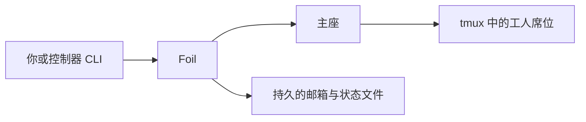

# 运筹 · Foil

[](LICENSE)
[](https://github.com/TiantianFlow/foil)
[](https://github.com/TiantianFlow/foil/actions/workflows/ci.yml)

[English](README.md)

**你的 Agent 们的忠诚反对派。** 运筹在你自己的终端里协调一组互补的本地 CLI Agent 席位。一个席位动手实现，另一个席位待在它看不见的上下文里找茬，由你掌控的主座负责配备人手和下达指令。邮件和状态落在磁盘上的持久文件里，席位跑在 tmux 中。没有托管控制面，没有聊天界面，没有 MCP，也没有需要登录的运筹账号。

这种反对不是角色扮演，而是结构上的独立。运筹中的席位是独立的 CLI 进程，不是共享同一个母模型上下文的 subagent。不同席位可以使用不同的 CLI、模型、人格、上下文和 worktree，让 reviewer 有机会发现同一类 Agent 容易共同复制的相关性盲区。这种多样性并不保证正确，但能让分歧和独立验证真实存在，而不只是同一段对话里的另一种语气。

如果你已经在本机同时跑着不止一个 CLI Agent，这些失败模式你一定不陌生：所有声音揉进同一段对话、tmux 会话被杀后上下文烟消云散、Agent 之间没有可持久交接的载体，以及不断有人劝你换上某个托管界面。运筹给出的答案是：继续留在终端里。你手头那套 Markdown 人设——包括 Agency Agents 和它的各种本地化副本——可以直接拿来用，运筹不会改写它们。

## 为什么选择运筹

- **互补席位，而不是一把混杂的声音。** 每个席位都是独立的 Agent CLI 进程，有自己的角色、上下文和工作目录。
- **现成人设，原样上岗。** [Agency Agents](https://github.com/msitarzewski/agency-agents) 以及中文等本地化副本（例如 [agency-agents-zh](https://github.com/jnMetaCode/agency-agents-zh)）都按原文件配备席位：不加包装，不翻译成运筹专用格式。
- **可持久化的协同。** 邮件、确认回执和席位状态都是磁盘上带版本的文件。在接收方确认之前，消息一直保持 `queued`——无论当时有没有人盯着屏幕。
- **中断后可恢复。** 杀掉 tmux、重启机器、再回来：`foil resume` 会按固定优先级复活席位——先找活着的 tmux 窗口，再用 CLI 原生的会话记录，最后才是记录在案的全新启动。
- **本地优先，不碰凭据。** 席位以你已经在本地完成认证的 Agent CLI 运行在你自己的机器上。运筹从不索取、保存或打印任何服务商凭据，也没有运筹账号。

## 它如何运转



一次典型的协作是这样的：你把运筹指向自己的仓库，拉起一名主座。主座按需配备互补的专家席位——一个实现者负责写代码，一个 reviewer-challenger 从独立上下文向方案发起挑战。主座把任务作为持久的邮箱消息发出去，产出不达标时直接要求返工，最后把经受住质疑的证据整合起来。你可以用普通的 CLI 命令和 tmux 检查一切。运筹是灵活的协同，而不是一条固定的「研究→实现→评审」流水线。

## 快速开始

你需要 Python 3.11+、uv、tmux 3.2+ 和 Git。下面的示例还会使用已经完成本地认证的 `grok` 和 `opencode` CLI；运筹不会经手这些登录。更想让本机已经在跑的 Agent 代劳，请直接看 [让 Agent 来装](#让-agent-来装)。

从 Git 安装运筹 0.1.0：

```sh
uv tool install "git+https://github.com/TiantianFlow/foil.git"
```

以后升级时，用同一地址重新安装：

```sh
uv tool install --reinstall "git+https://github.com/TiantianFlow/foil.git"
```

然后切换到你想让运筹协调的仓库。`foil init` 接受已有的 Git 仓库，并完整保留所有已跟踪和未跟踪的文件以及 Git 状态；对不是 Git 仓库的非空目录会直接拒绝。（空目录也可以——先运行 `git init -b foil-demo`，再运行 `foil init .`。）

```sh
# 然后在你已有的 Git 仓库中
cd your-repo
foil init .

# init 已经在 .foil/seats.toml 里写好互补的起步配方
# 如果 grok/opencode 不是本机该用的 CLI，再用 foil seats set 改
foil seat spawn --seat lead
foil seat spawn --seat implementer
foil seat spawn --seat reviewer-challenger
foil send-message --seat reviewer-challenger --sender lead --body "Please challenge the current plan." --wake
foil status
```

`foil init` 已经写好互补起步配方。发现本机 CLI 之后若要改映射，用 `foil seats set`；不要在 spawn 上临时编造 `--cli`。后续命令默认使用当前 Git 项目的运筹状态和其中唯一的活舰队。只有覆盖时才需要传 `--state-dir` 或 `--fleet`。`--cli`、`--model` 和其他启动参数只是临时覆盖。第一个席位必须是主座，工人席位在其后。`foil send-message` 只负责把邮件落盘——想提醒某个席位，请加上 `--wake`，或先检查 tmux 再运行 `foil seat wake`。想确认席位是不是真的活着，先跑 `foil status`。

内置预设只有 `grok` 和 `opencode`。别的交互式 CLI 要走 [声明式档案](#人格角色与其他-cli)，不要假设报个名字就能用。

## 让 Agent 来装

如果这个仓库里已经有本机 CLI Agent 在帮忙，你不必自己敲上面那些命令。对它说：

> 在这个项目里安装运筹，并按 README 里给 Agent 的搭建说明做完。

这一句就够了。它该执行的步骤在下一节。

## 如果你是来搭建运筹的 Agent

你是在本机配备一支舰队，不是在装一个托管产品。留在终端里。不要发明运筹账号、MCP 服务器，或浏览器控制面。

1. 确认 Python 3.11+、uv、tmux 3.2+ 和 Git。用
   `uv tool install "git+https://github.com/TiantianFlow/foil.git"`
   安装运筹。
2. 在用户已有的 Git 仓库里运行 `foil init .`。后续命令默认针对这个项目；
   只有覆盖时才传 `--state-dir` 或 `--fleet`。
3. 先发现本机有哪些 Agent CLI（`grok`、`opencode`，以及用户已经在用、
   并备好档案的其他 CLI）。看不清就问。`foil doctor` 会报告 tmux、Git
   和已知 CLI，但不会去读凭据。再问这些 CLI 能启动哪些模型、各自还剩多少用量。
4. 建议拉一份本地 Markdown 人设目录。中文场景优先
   [agency-agents-zh](https://github.com/jnMetaCode/agency-agents-zh)，
   英文原版是
   [Agency Agents](https://github.com/msitarzewski/agency-agents)；
   其他本地化副本同样适用。克隆或复制到项目旁边（例如 `./personas`），
   **不要改文件内容**。运筹按原文使用。
5. 问用户实际在做什么。按这个答案挑一小支互补队伍：至少一名主座、
   一名实现者、一名质疑者。不要因为角色库里有八份模板就拉满八个席位。
6. `foil init` 已经写好互补起步配方（主座和实现者用 `grok`，质疑者用
   `opencode`）。发现本机 CLI 之后，若要换 CLI、模型或 `--role-file`
   人设，用 `foil seats set` 改这份文件，不要从零编造 `--cli`。映射有
   取舍时先说清楚，等用户点头。
7. 在项目里拉起席位：先 `foil seat spawn --seat lead`，再拉工人。
   不要在 spawn 上再传 `--cli`、`--lead` 或 `--model`，除非你是在覆盖文件。
   然后跑 `foil status`。
8. 把日常命令交回给用户：`foil status`、`tmux`、
   `foil send-message --wake`、`foil resume`。主座在、互补席位已映射、
   用户能自己查看舰队，你的搭建就结束了。

## 运营一支舰队

**一支舰队对应一个 worktree。** 为项目保留一个干净、与远端 `main` 保持 fast-forward 的基准 checkout；为每支舰队创建一个专用的功能 worktree，并在其中运行主座和工人席位。绝不要让舰队改动基准 checkout；如果它变脏了，应当报错并通知，而不是替它收拾。显式选择其他基准也完全可以——这是给你的操作守则，不是运筹强制的功能。

**由主座决定成员。** 每支舰队从一名主座开始。主座（或你）按需从角色库拉起工人席位。工人默认隔离。同一仓库里的工人通过 `git clone --local` 得到 `worktrees/<seat_id>`，因此未提交的文件不会被带进去，之后的提交也不会自动刷新这些克隆；`foil doctor` 会报告落后情况。若要从另一个 Git 仓库隔离，传入 `--from PATH`：运筹会在 `<PATH>/worktrees/<seat_id>` 上执行 `git worktree add`。配方里的 `cwd` 和 `--cwd` 始终是目的地；若它们指向另一个仓库的基准 checkout，会被拒绝。需要共享目录时，使用高级选项 `--shared-cwd`。

**诚实的席位状态。** `working` 只表示 tmux 进程还活着——不代表模型正在思考。`foil status` 会把注册表与活着的 tmux 对账；`foil poll-status` 只读带版本的状态文件。

**中断与恢复。** `foil resume` 优先复用匹配的存活 tmux 窗口，其次是席位记录的原生会话，最后是记录在案的全新启动。`foil seat stop` 会保留席位记录，供 `foil resume` 在中断后继续；`foil seat remove` 才会删除记录。权限先看 `.foil/seats.toml`；文件没写时 spawn 才默认 `supervised`（CLI 会逐个请求批准）。在文件里或 spawn 上写 `--permission auto`，才会使用适配器声明的自动批准参数。

## 人格、角色与其他 CLI

`foil init` 会在 `.foil/roles/` 下生成角色库（manager、implementer、reviewer-challenger 等）。你也可以直接用本地 Markdown 人格目录来配备席位——人格文件原样使用，不加包装。这包括 [Agency Agents](https://github.com/msitarzewski/agency-agents) 和它的本地化副本（中文可用 [agency-agents-zh](https://github.com/jnMetaCode/agency-agents-zh)）。运筹不拥有这些人设，也不要求改成运筹格式：

```sh
git clone https://github.com/jnMetaCode/agency-agents-zh.git ./personas
foil catalog-list --path ./personas
foil catalog-map --path ./personas --persona NAME --json
foil seats set --seat designer --cli grok --role-file ./personas/path/to/designer.md
foil seat spawn --seat designer
```

`catalog-map` 只返回人设文件的 `path`，不会指定 CLI：`cli` 和 `preset` 始终为空。把配备写进 `foil seats set`。

Grok 和 OpenCode 是内置预设。其他交互式 CLI 通过声明式席位档案接入——一个 TOML 文件掌管可执行文件、启动/恢复/初始化参数、会话捕获、权限标志、工作目录行为，以及按变量名声明的环境转发（值永不落盘）：

先把随仓库发布的 [`profiles/pi-interactive.toml`](profiles/pi-interactive.toml) 示例保存或复制到你要协调的仓库，再为相应席位传入它的路径：

```sh
foil seats set --seat researcher --profile ./profiles/pi-interactive.toml --role researcher
foil seat spawn --seat researcher
```

spawn 上的 `--profile` 仍可临时覆盖席位文件。

内置预设与档案是仅有的两条受支持路径——如果某个 CLI 既不是预设、你也没有用档案跑通过，就不要假设它可用。当你传入 `--model` 时，运筹会把你的选择转交给 CLI；CLI 自己的界面才是实际启动了哪个模型的最终依据。

## 安全与限制

- 运筹提供的是同一用户下的协作式保护，不是针对恶意行为的隔离。席位以你的身份、使用你的 CLI 凭据、在你的机器上运行。
- 运筹从不保存服务商凭据，也从不打印环境变量或终端缓冲区内容。
- 没有 MCP 服务器，没有托管服务，也没有任何需要登录的东西。

## 进一步了解

- [docs/walking-skeleton.md](docs/walking-skeleton.md)——可执行的端到端验证路径
- [docs/design/onboarding.md](docs/design/onboarding.md)——初始化与状态根契约
- [docs/design/seats.md](docs/design/seats.md)——`.foil/seats.toml` 里的预定义席位配方
- [docs/design/profiles.md](docs/design/profiles.md)——声明式席位档案契约
- [skills/controller](skills/controller)、[skills/manager](skills/manager)、[skills/worker](skills/worker)——给驱动或加入舰队的 CLI 使用的可移植 skill
