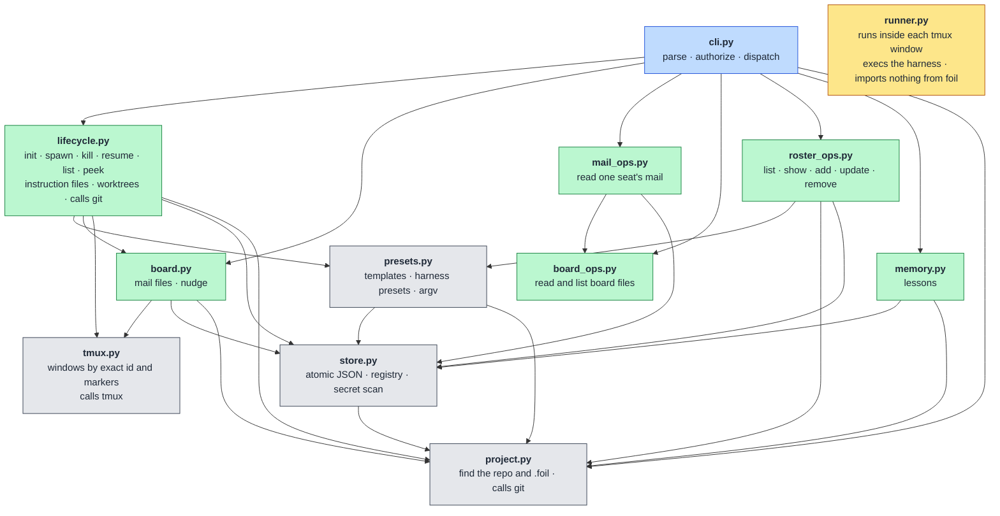
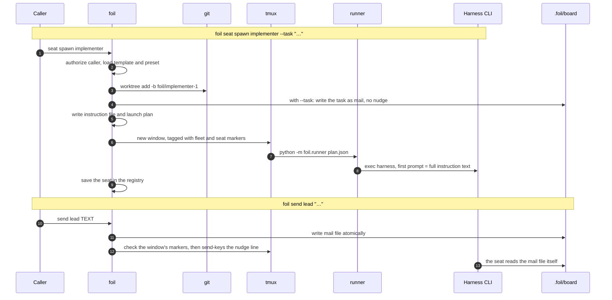

# Architecture

This document describes Foil 0.3.1 as implemented. It does not add requirements. The command list and the data layout are specified in [requirements.md](requirements.md).

## Components

Foil is a Python 3.11+ program with no runtime dependencies. It uses Git, tmux, and the harness CLIs already installed on the machine. Package code lives under `src/foil`.

| Module | Role |
|---|---|
| `src/foil/cli.py` | Parses the command line, decides who the caller is, and dispatches. It does not talk to tmux. |
| `src/foil/project.py` | Finds the Git toplevel and the `.foil` directory. |
| `src/foil/store.py` | Writes JSON atomically, loads the registry, and rejects credential-shaped text. |
| `src/foil/presets.py` | Loads harness presets and role templates, scans which eligible presets are installed, and expands launch argv. It does not start a process. |
| `src/foil/roster_ops.py` | Lists, shows, adds, updates, and removes role templates. Writes are atomic and refuse a symlink. |
| `src/foil/lifecycle.py` | Initializes a project and spawns, kills, resumes, lists, and peeks seats. It writes instruction files. |
| `src/foil/tmux.py` | Creates, stops, and reads tmux windows by exact window id. |
| `src/foil/board.py` | Writes mail files, then asks tmux to type the nudge line. |
| `src/foil/mail_ops.py` | Reads one seat's mail. Paths must stay inside `.foil/board/mail/`. |
| `src/foil/board_ops.py` | Reads and lists board files. Paths must stay inside `.foil/board/`. |
| `src/foil/memory.py` | Stores project lessons as JSON files. |
| `src/foil/runner.py` | Execs the argv in a launch plan. It does not choose that argv. |
| `src/foil/errors.py` | Carries the one-line errors the CLI prints. |

### Module layers

Each arrow points from a module to one it imports. Every module also raises
the one-line errors in `errors.py`; those arrows are left out.



### Spawn and send

What happens across processes when a seat is spawned with a task, and when
mail is sent later.



Shipped presets are `src/foil/defaults/harnesses`. Shipped personas are `src/foil/defaults/personas`, including the candidate roles. A project file `.foil/harnesses/<id>.toml` overrides the preset with the same id, so that id is counted once. `init` scans every eligible preset whose own `command[0]` is on `PATH`, skips `fake`, and sorts the ids by Unicode code point with case preserved. That order is a tiebreak, not a ranking. `lead` and `implementer` get the first installed id. `reviewer` gets the second when one exists, and the first otherwise. The report then counts the distinct harness ids stored in those three templates. Two ids can still run the same program or model; set model on a template to choose one. Tests put `foil-fake` on `PATH` and point templates at it themselves.

## Where state lives

`foil init` creates `.foil` in the Git toplevel and adds `/.foil/` to that repository's exclude file, so Foil's files stay out of `git status`. The report starts with the version. It then lists every installed eligible harness in id order, the id each default template was given and why, which templates and personas it wrote and which it left alone, `Available personas (use 'foil roster add')` when a persona has no template, `Updated skills: …` or `Skills: current`, a built-in preset overridden by `.foil/harnesses` when one is, a sentence about the permission setting, and the operator pointer line. A re-run prints the report again. It overwrites no template, persona, or preset, and it replaces the operator skill when its bytes differ from this version. It does not write the lead or worker skill, and it does not delete an older copy of either. The directory holds:

- `templates/<role>.toml` — the roster. The file name is the role. Fields used by the loader are `harness`, `model`, `persona`, `worktree`, and `permission`. Template and preset keys are added, never renamed, and a new key is optional. `foil roster` lists, shows, adds, updates, and removes these files. Add and update write atomically in this directory and refuse a symlink. Remove, and a harness change, fail while a seat of that role has a stored state other than `killed`.
- `templates/personas/<role>.md` — every packaged persona, copied once, including candidate roles that have no template yet. A persona adds only specialization the role skill does not already state. A template may instead point `persona` at another Markdown file, which is left untouched, or it may hold inline text.
- `harnesses/` — optional project presets.
- `memory/<id>.json` — lessons. They belong to the project and stay when seats are killed.
- `board/mail/<seat>/` — mail files. Seats read them with `foil mail read` and `foil mail list`, and read notes, tasks, results, and status with `foil board read` and `foil board list`. `mail list` does not follow a symlink at `board/mail`. Foil parses front matter only to print a file and does not act on contract fields.
- `run/registry.json` — fleet id, tmux session name, lead name, and one record per seat: name, template, harness, model, window id, state, worktree, branch, and session id. `model` is recorded at spawn and at resume. A record from before that field loads it as empty. The session name is `foil-`, then up to 32 characters of the repository directory name with every non-alphanumeric run turned into a single `-` and the surrounding dashes removed, or `repo` when that leaves nothing, then `-` and the first 8 hex characters of the SHA-256 of the resolved toplevel path. That derivation, the session marker `@foil-fleet-id`, and the window marker `@foil-seat-id` are a cross-version contract. They change only when a release tells you to drain the fleet with the old binary first (`foil seat kill --all`). A mid-goal upgrade works while this contract and the registry schema stay compatible. The recommended path is still between goals: kill the fleet, update, run `foil init`, then spawn the lead.
- `run/instructions/<seat>.md` — generated when that seat is spawned or resumed. It includes the text of that seat's role skill and the Foil version that wrote the file.
- `skills/operator.md` — the operator skill. `init` replaces it when its bytes differ, atomically, and refuses a symlink. The report says `Updated skills: …` or `Skills: current`. The lead and worker skills are read from the package and inlined into the instruction file. An older copy of either in this directory is left unread.
- `run/plans/<seat>.json` — the argv, working directory, and environment for the runner.

A linked worktree does not contain `.foil`. How a seat still finds the project is described under "Worktrees, project state, and harness sessions".

## Worktrees, project state, and harness sessions

This is how Foil 0.3.1 creates worktrees. It is the current design, not a new requirement.

Seat trees are flat, one level deep, under the project's `.foil`. There is no tree for the lead, and one agent's tree is never nested inside another's.

```text
<project>/                         the checkout where foil init ran; it holds .foil
  .foil/
    worktrees/
      <label>/                     branch foil/<label>, sibling of every other seat tree
      <label>-2/
```

`<project>` is the Git toplevel where `foil init` ran. It is usually the main checkout. It can itself be a linked worktree, if init ran there. The lead has no tree of its own: `lead.toml` ships with `worktree = false`, so the lead's working directory is `<project>`. Default roles are lead, implementer, and reviewer. By default only the reviewer, besides the lead, has `worktree = false` and shares that same directory.

A template with `worktree = true` gets `<project>/.foil/worktrees/<label>` on a new branch `foil/<label>`. Spawn runs `git worktree add -b` with no start point, so the branch forks from whatever `<project>` has checked out at spawn time, not from `main`. A taken branch or directory uses `foil/<label>-2`, then `-3`, and so on. Spawn never uses `-B`. Every seat tree is a sibling, and all of them register in the same Git common dir. Spawn is lead-or-operator: the CLI allows it for the lead and for the operator outside the fleet. `discover_project` calls `git_toplevel`. That returns the Git toplevel when the toplevel already contains `.foil`. Otherwise it returns the parent of `git rev-parse --git-common-dir` when that parent contains `.foil`, and otherwise the toplevel. For a seat tree under `<project>/.foil/worktrees/`, that toplevel does not contain `.foil`, and the common dir's parent is the main checkout. That parent is `<project>` only when `<project>` is the main checkout. When `foil init` ran in a linked worktree, the parent is a different checkout, so a spawn from the seat tree can report "not initialized" or use that other checkout's `.foil`. It does not always land in `<project>`. A path under the repository's top-level `worktrees/`, or anywhere else in the project outside `.foil`, is refused. Killing a seat, or a launch that fails after the worktree exists, does not remove the worktree or the branch.

Foil's own state exists only in `<project>/.foil`: `templates/`, `harnesses/`, `skills/`, `memory/`, `board/` (mail, notes, tasks, results, and status), `run/registry.json`, `run/instructions/`, and `run/plans/`. `foil init` writes `/.foil/` to `git rev-parse --git-path info/exclude`. That file is in the Git common dir, so the exclusion applies to every linked worktree too. Seat trees do not contain `.foil`.

A seat reaches that state in two ways. `foil send`, `foil memory`, `foil seat`, and `foil roster` use the same `git_toplevel` discovery. They see `<project>/.foil` from a seat tree only when the common dir's parent is `<project>` and that parent contains `.foil`. Otherwise they see the seat tree's own toplevel, which has no `.foil`, and report "not initialized", or they see another checkout's `.foil`. `foil mail` and `foil board` do not: `board_root()` walks up from the current directory and uses the first `.foil/board` it finds. That walk works only because seat trees sit under `<project>/.foil/worktrees/`.

| File or directory | Which tree | Tracked? | How a seat reaches it |
| --- | --- | --- | --- |
| `.foil/` (templates, harnesses, skills, memory, board, run) | Project checkout only | No (`/.foil/` in the common dir's exclude) | Git toplevel discovery, or a walk up to `.foil/board` |
| `AGENTS.md`, `CLAUDE.md`, `.cursor/rules/`, and similar | Every tree, at that tree's commit | Yes | The seat reads its own checkout; a project-checkout edit arrives only once the seat's branch includes it |
| A gitignored local file (for example a harness settings file) | Project checkout only | No | It does not. `git worktree add` does not copy it, so a worktree seat runs without it while the lead and other non-worktree seats have it |

Foil stores only a session id per seat, in `run/registry.json`. Each harness keeps transcripts and trust under the user's home directory. Foil forwards `HOME`, so every seat writes into the same global store as the human. Those stores are keyed by working directory. Moving or renaming the project changes every key, and a harness that resumes by a directory lookup can then miss the old session. Foil's tmux session name hashes the resolved toplevel path, so a move is a new fleet anyway.

| Preset | `session_id` | Resume argv | Scoped by | Verified |
| --- | --- | --- | --- | --- |
| claude | `generated` | `claude --resume {session_id}` | Explicit id | The argv is the preset. Directory-per-cwd storage under `~/.claude/projects/` is observed: names for earlier fleets' `.foil/worktrees/<seat>` paths remain after those seats were killed |
| grok | `generated` | `grok --resume {session_id}` | Explicit id | The argv is the preset. Storage layout unverified |
| fake | `generated` | `foil-fake --session {session_id}` | Explicit id | The argv is the preset |
| codex | `none` | `codex resume --last` | Latest session for this directory | The argv is the preset. Whether "latest" is the exact cwd or the whole repository is unverified |
| opencode | `none` | `opencode . --continue` | Latest session for this directory | The argv is the preset. Whether "latest" is the exact cwd or the whole repository is unverified |
| gemini | `none` | `gemini --resume` | Neither an id nor a directory flag | The argv is the preset. It always starts fresh. The preset marks its flags unverified |

An explicit id stays unambiguous when seats share a working directory. `--continue` and `--last` mean the latest session for this directory, so Foil refuses that native resume for a seat with no worktree and starts it fresh in the project directory. Trust is path-keyed too. A seat worktree inherits the project's trust because the tree is nested under the trusted project path. Observed for Claude: most seat paths have no trust entry of their own, and a few do.

Keep `.foil`, board included, per project.

1. Board discovery by walking up, and trust inheritance, both depend on seat trees being nested under the project. A global location breaks both.
2. The registry, the tmux session name, and mail paths are per toplevel. A global board would need a project key everywhere, and a migration, which this design does not add.
3. Harnesses keeping sessions globally is not a reason for Foil to do the same. Foil holds only ids, and those stores are already keyed by path, so per-project Foil state lines up with them.

## Authority

The caller is outside the fleet when `FOIL_SEAT_ID` is unset. The lead is the process whose variable is `lead`. Every other value is a worker. The CLI allows or refuses the action before it changes anything. A worker cannot spawn, kill, or resume, and cannot accept or reject a lesson. The lead cannot kill the seat named `lead` and cannot run `foil seat kill --all`. The lead also cannot set a template's `permission`, including `roster add --from` when the file's permission is not `auto`; only a caller outside the fleet can. An omitted permission is `auto`. No flag selects a different identity.

## Spawn

`foil seat spawn TEMPLATE` loads that template and its preset. The lead seat is always named `lead`, and it has to be the first seat. Later seats are named `<template>-1`, `<template>-2`, and so on, unless `--name` is given. A name that is already in the registry is not reused. A generated name that cannot fit the registry's id rule is skipped; if none fit, spawn stops before it creates a worktree or a window.

When the template sets `worktree` true, spawn runs `git worktree add -b` on `foil/<seat>` in `.foil/worktrees/<label>`. If that branch or its directory is taken, it uses `foil/<seat>-2`, then `foil/<seat>-3`, and so on, and the directory uses the same suffix. The branch is new. Spawn does not use `-B` and does not reset an existing branch. A path under the repository's top-level `worktrees/` directory, or anywhere else inside the project outside the Foil folder, is refused. On a later failure it does not remove that worktree or delete the branch. Killing a seat does not either.

Spawn writes the instruction file, then a plan, then a tmux window. The window runs `python -m foil.runner` on the plan. The runner changes to the plan's directory and execs the harness. The plan's own environment sets `FOIL_SEAT_ID` to the seat name. Other variables are listed by name in `env_forward` and copied from the window's environment at exec time, so their values are not stored in the plan. `PATH` and `HOME` are always forwarded, and a preset's `env` names any further variables. A variable a preset names takes its value from the tmux server's environment. `PATH` comes from the spawning caller. The first launch prompt is the instruction file's full text. With `--task`, it names that task's mail file and tells the seat to read it first; without `--task`, it tells the seat to run `foil mail list` and read its mail before it acts. Placeholders in the preset are `{model}`, `{prompt}`, and `{session_id}`. A missing value drops that token and a flag that only introduced it. A model that starts with `-` is invalid and is not placed in that argv. Permission extras are inserted for both a fresh start and a resume.

The instruction file includes the persona's text. When the template points at a Markdown file, that file is read and inlined; the file itself is left unchanged.

`--task` is mail written before launch, with no nudge. If launch fails, that file is removed. `foil send` is unchanged: it still writes, then nudges.

## Instruction file

The file is regenerated on spawn and on resume, not when a lesson is accepted later. It names the Foil version that wrote it, the seat, the lead (`lead`), the absolute board path, and the commands that role may run. It includes the role skill's text and the persona's text, not only a path to either, and its last line tells the seat to re-read this file whenever it is woken. It states that mail is a file, that the nudge line is the sender and the mail path, and that notes wake nobody. It names the `status/v1`, `task/v1`, and `result/v1` contracts. It tells a worktree seat to stay in its worktree. Accepted lessons are copied in, or the file says none yet. The lead's file also lists each template's harness and whether it asks for a worktree. On a first launch with `--task`, it names that task's mail file, tells the seat to read it first, and says older mail may be from an earlier goal: `foil seat kill` keeps `board/mail/<seat>/`, and the lead's name is always `lead`. Without `--task`, it tells the seat to run `foil mail list` and read its mail before it acts. If this launch is a fresh start after a restart, the file says the seat was restarted and should list its mail with `foil mail list` and read each file with `foil mail read`.

## Mail and nudge

`foil send TO TEXT` checks the recipient against the registry before it writes. An unknown seat prints one stderr line and leaves no file. `TEXT` of `-` reads stdin. The sender is `user` when the caller is outside the fleet, and the seat id when a seat sends. There is no operator mailbox.

The file is Markdown with `contract: mail/v1` and `from`, `to`, and `time`. After the file exists, Foil types one line if the seat's stored window still carries this fleet's and this seat's tmux markers: the sender, a space, and the absolute mail path. The body is not typed. tmux is invoked as `send-keys -l -t @<window id> -- <line>`, and only if that succeeds, `send-keys -t @<window id> Enter`. The window id is the stored id, not a name. tmux reuses window ids after its server restarts, so the marker check keeps a nudge from reaching another seat. If the window is gone or belongs to someone else, the send still succeeds and the file remains. Foil does not read the pane before typing, so the line is typed even when the pane is not at a prompt.

## Kill, resume, list, and peek

`foil seat kill NAME` stops the stored window id and sets the seat's stored state to `killed`. A window that is already gone is still marked killed. A dead seat whose process has exited can still have its window: remain-on-exit keeps it, and kill removes that leftover window before it marks the seat killed. The name stays reserved. The worktree, branch, and uncommitted files stay.

`foil seat kill --all` does that for every seat. Only a caller outside the fleet can run it.

`foil seat resume NAME` refuses a killed seat. If the named seat's pane process is still running, it prints that the seat is alive and does not launch again. A dead seat can still have a window, because the window stays after the process exits. Resume removes that leftover window before it launches again, so the seat ends with one window. With no name, resume restarts every dead seat and skips killed and alive ones. A seat that cannot be restarted does not stop the others: resume prints `foil: seat '<name>' not resumed: <reason>` on stderr for each one, restarts the rest, and exits 1.

Resume reads the harness from the template file now, not from the harness stored on the seat. That same preset both decides native resume and builds the argv. If the template harness differs from the stored one, the old session id is dropped and the registry harness becomes the template harness. If it is unchanged, the stored session id is kept. Native resume is used when the preset has a resume argv and a generated session id is present, or when the seat has its own worktree and the argv contains `--continue` or `--last`. A seat with no worktree does not use those directory-scoped flags; it starts fresh in the project directory. Any other seat without a native resume starts fresh. A generated-session preset mints a new id for a fresh start. Permission extras still apply.

Alive, dead, and killed come from the registry and from the tmux window with the stored id. The seat is alive when that window exists, carries this fleet's and this seat's markers, and its pane process is still running. It is dead when the window is gone, when the markers do not match, or when tmux reports `#{pane_dead}` for that window. That flag is a tmux fact about the process, not a reading of the pane. List prints `name`, `template`, `state`, `worktree`, the harness and model recorded at the last launch, and the template's current description, tab-separated, or the same fields as JSON. The description is empty when the template is gone or cannot be read. It does not classify pane text.

`foil seat peek NAME` runs `tmux capture-pane -p -t @<window id> -S -<N>` and writes that stdout unchanged. The default `N` is 40. It does this for an alive seat and for a dead seat whose window still exists and still carries this fleet's and this seat's markers, so a harness that exited at launch leaves an error line that can be read. A killed seat, a dead seat whose window is gone, or a stored id that now names another window is an error. Peek does not interpret the text.

## Memory

`foil memory add` writes a proposed lesson and prints its id. `--replaces` names an existing lesson. `foil memory accept` and `foil memory reject` are limited to the lead and to callers outside the fleet. Accepting a lesson that names a replacement marks the replaced lesson superseded. `foil memory list` prints accepted lessons; `--all` includes proposed, rejected, and superseded. Lessons are included in an instruction file only at the next spawn or resume.

## What Foil does not do

Foil does not parse pane contents or decide that an agent is idle. It parses front matter only to print a file and does not act on contract fields. It does not store harness credentials. It does not delete a worktree or a branch when a seat is killed or when a launch fails after the worktree was created.
