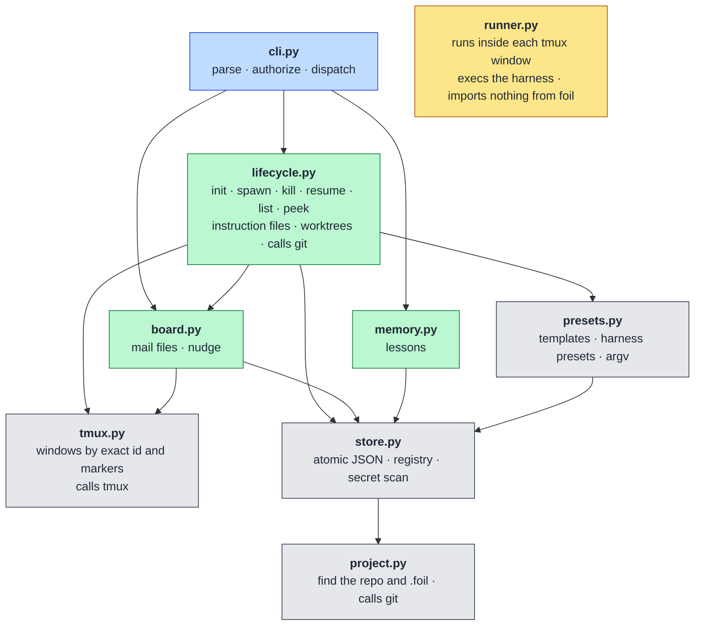
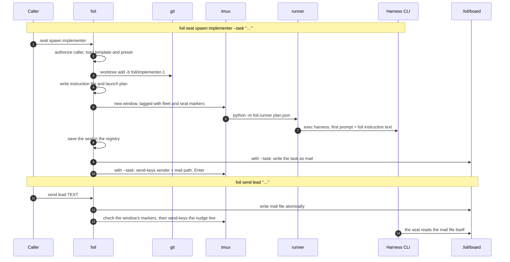

# Architecture

This document describes Foil 0.2.2 as implemented. It does not add requirements. The command list and the data layout are specified in [requirements.md](requirements.md).

## Components

Foil is a Python 3.11+ program with no runtime dependencies. It uses Git, tmux, and the harness CLIs already installed on the machine. Package code lives under `src/foil`.

| Module | Role |
|---|---|
| `src/foil/cli.py` | Parses the command line, decides who the caller is, and dispatches. It does not talk to tmux. |
| `src/foil/project.py` | Finds the Git toplevel and the `.foil` directory. |
| `src/foil/store.py` | Writes JSON atomically, loads the registry, and rejects credential-shaped text. |
| `src/foil/presets.py` | Loads harness presets and role templates, scans which eligible presets are installed, and expands launch argv. It does not start a process. |
| `src/foil/lifecycle.py` | Initializes a project and spawns, kills, resumes, lists, and peeks seats. It writes instruction files. |
| `src/foil/tmux.py` | Creates, stops, and reads tmux windows by exact window id. |
| `src/foil/board.py` | Writes mail files, then asks tmux to type the nudge line. |
| `src/foil/memory.py` | Stores project lessons as JSON files. |
| `src/foil/runner.py` | Execs the argv in a launch plan. It does not choose that argv. |
| `src/foil/errors.py` | Carries the one-line errors the CLI prints. |

### Module layers

Each arrow points from a module to one it imports. Every module also raises
the one-line errors in `errors.py`; those arrows are left out.

### Spawn and send

What happens across processes when a seat is spawned with a task, and when
mail is sent later.

Shipped presets are `src/foil/defaults/harnesses`. Shipped personas are `src/foil/defaults/personas`, including the candidate roles. A project file `.foil/harnesses/<id>.toml` overrides the preset with the same id, so that id is counted once. `init` scans every eligible preset whose own `command[0]` is on `PATH`, skips `fake`, and sorts the ids by Unicode code point with case preserved. That order is a tiebreak, not a ranking. `lead` and `implementer` get the first installed id. `reviewer` gets the second when one exists, and the first otherwise. The report then counts the distinct harness ids stored in those three templates. Two ids can still run the same program or model; set model on a template to choose one. Tests put `foil-fake` on `PATH` and point templates at it themselves.

## Where state lives

`foil init` creates `.foil` in the Git toplevel and adds `/.foil/` to that repository's exclude file, so Foil's files stay out of `git status`. It prints a report: every installed eligible harness in id order, the id each default template was given and why, which templates and personas it wrote and which it left alone, a sentence about the permission setting, and the operator pointer line. A re-run prints the report again and overwrites nothing. The directory holds:

- `templates/<role>.toml` — the roster. The file name is the role. Fields used by the loader are `harness`, `model`, `persona`, `worktree`, and `permission`.
- `templates/personas/<role>.md` — every packaged persona, copied once, including candidate roles that have no template yet. A persona adds only specialization the role skill does not already state. A template may instead point `persona` at another Markdown file, which is left untouched, or it may hold inline text.
- `harnesses/` — optional project presets.
- `memory/<id>.json` — lessons. They belong to the project and stay when seats are killed.
- `board/mail/<seat>/` — mail files. `board/notes/`, `board/tasks/`, and `board/results/` are directories seats use with ordinary file tools. Foil does not read task, result, note, or status files.
- `run/registry.json` — fleet id, tmux session name, lead name, and one record per seat: name, template, harness, window id, state, worktree, branch, and session id.
- `run/instructions/<seat>.md` — generated when that seat is spawned or resumed. It includes the text of that seat's role skill.
- `skills/operator.md`, `skills/lead.md`, and `skills/worker.md` — copied once from the package. Each file starts with a name and description. Init does not overwrite a file that is already there. The lead and worker skills are the role guidance for those seats.
- `run/plans/<seat>.json` — the argv, working directory, and environment for the runner.

A linked worktree does not contain `.foil`. From that worktree, discovery walks to the Git common directory and uses the parent that contains `.foil`, so a seat can run `foil send` and `foil memory` against the project.

## Authority

The caller is outside the fleet when `FOIL_SEAT_ID` is unset. The lead is the process whose variable is `lead`. Every other value is a worker. The CLI allows or refuses the action before it changes anything. A worker cannot spawn, kill, or resume, and cannot accept or reject a lesson. The lead cannot kill the seat named `lead` and cannot run `foil seat kill --all`. No flag selects a different identity.

## Spawn

`foil seat spawn TEMPLATE` loads that template and its preset. The lead seat is always named `lead`, and it has to be the first seat. Later seats are named `<template>-1`, `<template>-2`, and so on, unless `--name` is given. A name that is already in the registry is not reused. A generated name that cannot fit the registry's id rule is skipped; if none fit, spawn stops before it creates a worktree or a window.

When the template sets `worktree` true, spawn runs `git worktree add -b` on `foil/<seat>` in `.foil/worktrees/<label>`. If that branch or its directory is taken, it uses `foil/<seat>-2`, then `foil/<seat>-3`, and so on, and the directory uses the same suffix. The branch is new. Spawn does not use `-B` and does not reset an existing branch. A path under the repository's top-level `worktrees/` directory, or anywhere else inside the project outside the Foil folder, is refused. On a later failure it does not remove that worktree or delete the branch. Killing a seat does not either.

Spawn writes the instruction file, then a plan, then a tmux window. The window runs `python -m foil.runner` on the plan. The runner changes to the plan's directory and execs the harness. The plan's own environment sets `FOIL_SEAT_ID` to the seat name. Other variables are listed by name in `env_forward` and copied from the launch environment at exec time, so their values are not stored in the plan. `PATH` and `HOME` are always forwarded, and a preset's `env` names any further variables. The first launch prompt is the instruction file's full text. Placeholders in the preset are `{model}`, `{prompt}`, and `{session_id}`. A missing value drops that token and a flag that only introduced it. Permission extras are inserted for both a fresh start and a resume.

The instruction file includes the persona's text. When the template points at a Markdown file, that file is read and inlined; the file itself is left unchanged.

`--task` is mail sent after the registry is saved. It uses the same write-then-nudge path as `foil send`.

## Instruction file

The file is regenerated on spawn and on resume, not when a lesson is accepted later. It names the seat, the lead (`lead`), the absolute board path, and the commands that role may run. It includes the role skill's text and the persona's text, not only a path to either, and its last line tells the seat to re-read this file whenever it is woken. It states that mail is a file, that the nudge line is the sender and the mail path, and that notes wake nobody. It names the `status/v1`, `task/v1`, and `result/v1` contracts. It tells a worktree seat to stay in its worktree. Accepted lessons are copied in, or the file says none yet. The lead's file also lists each template's harness and whether it asks for a worktree. If this launch is a fresh start after a restart, the file says the seat was restarted and should re-read its mail.

## Mail and nudge

`foil send TO TEXT` checks the recipient against the registry before it writes. An unknown seat prints one stderr line and leaves no file. `TEXT` of `-` reads stdin. The sender is `user` when the caller is outside the fleet, and the seat id when a seat sends. There is no operator mailbox.

The file is Markdown with `contract: mail/v1` and `from`, `to`, and `time`. After the file exists, Foil types one line if the seat's stored window still carries this fleet's and this seat's tmux markers: the sender, a space, and the absolute mail path. The body is not typed. tmux is invoked as `send-keys -l -t @<window id> -- <line>`, and only if that succeeds, `send-keys -t @<window id> Enter`. The window id is the stored id, not a name. tmux reuses window ids after its server restarts, so the marker check keeps a nudge from reaching another seat. If the window is gone or belongs to someone else, the send still succeeds and the file remains. Foil does not read the pane before typing, so the line is typed even when the pane is not at a prompt.

## Kill, resume, list, and peek

`foil seat kill NAME` stops the stored window id and sets the seat's stored state to `killed`. A window that is already gone is still marked killed. The name stays reserved. The worktree, branch, and uncommitted files stay.

`foil seat kill --all` does that for every seat. Only a caller outside the fleet can run it.

`foil seat resume NAME` refuses a killed seat. If the named seat's window still exists, it prints that the seat is alive and does not launch again. With no name, resume restarts every dead seat and skips killed and alive ones. A seat that cannot be restarted does not stop the others: resume prints `foil: seat '<name>' not resumed: <reason>` on stderr for each one, restarts the rest, and exits 1.

Resume reads the harness from the template file now, not from the harness stored on the seat. That same preset both decides native resume and builds the argv. If the template harness differs from the stored one, the old session id is dropped and the registry harness becomes the template harness. If it is unchanged, the stored session id is kept. Native resume is used when the preset has a resume argv and a generated session id is present, or when the seat has its own worktree and the argv contains `--continue` or `--last`. A seat with no worktree does not use those directory-scoped flags; it starts fresh in the project directory. Any other seat without a native resume starts fresh. A generated-session preset mints a new id for a fresh start. Permission extras still apply.

Alive, dead, and killed come from the registry and from whether a tmux window with the stored id still exists and carries this fleet's and this seat's markers. List prints `name`, `template`, `state`, and `worktree`, tab-separated, or the same four fields as JSON. It does not classify pane text.

`foil seat peek NAME` runs `tmux capture-pane -p -t @<window id> -S -<N>` and writes that stdout unchanged. The default `N` is 40. A dead or killed seat is an error. Peek does not interpret the text.

## Memory

`foil memory add` writes a proposed lesson and prints its id. `--replaces` names an existing lesson. `foil memory accept` and `foil memory reject` are limited to the lead and to callers outside the fleet. Accepting a lesson that names a replacement marks the replaced lesson superseded. `foil memory list` prints accepted lessons; `--all` includes proposed, rejected, and superseded. Lessons are included in an instruction file only at the next spawn or resume.

## What Foil does not do

Foil does not parse pane contents, read `status.md`, or decide that an agent is idle. It does not store harness credentials. It does not delete a worktree or a branch when a seat is killed or when a launch fails after the worktree was created.
